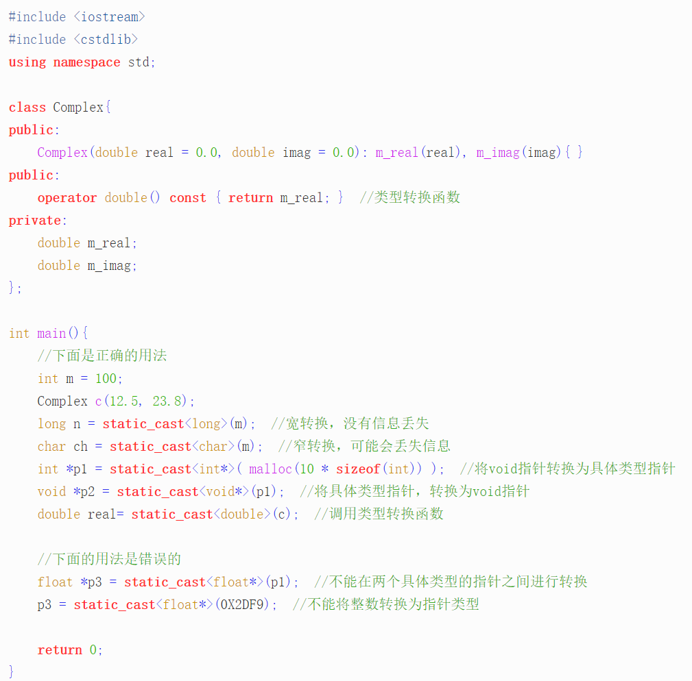

# C++面试题总结

## 内存结构

1. 堆/栈/全局（静态）存储区/常量存储区/程序代码区

## C++的性质

* 封装/继承/多态
* 封装

1. 其实就是public 和 private

* 继承

* 多态：将基类类型指针或引用指向派生类的对象，接口重用。

1. 重载：允许存在多个同名函数，这些函数的参数表不同，返回类型也可以不同。
2. 覆盖（重写）： 指定子类重新定义父类的虚函数的做法。在父类定义一个virtual方法，在子类重写这个方法。参数/返回类型都必须相同，如果只有返回类型不同，会报错；否者会视为普通的函数重载，虚函数特性丢失，访问修饰符可以不同（public/private)
3. 重定义：子类中重新定义父类中相同名称的非虚函数，派生类的函数隐蔽类与其同名的基类函数。可以理解为发生在继承中的重载。
4. 虚函数：虚函数的作用是允许在派生类中重新定义与积累同名的函数。

## 子类析构时要调用父类的析构函数吗？

1. 析构和构造函数和栈相似。

## 多态，虚函数，纯虚函数

1. 虚函数：在基类中冠以关键字virtual的成员函数，提供一种接口节面，允许派生类中对基类的虚函数重新定义。
2. 纯虚函数：在基类中为其派生类保存一个函数的名字，以便派生类根据需要对它进行定义，作为接口而存在，纯虚函数不具备函数的功能，一般不能被直接调用。
3. 包含至少一个纯虚函数的类为抽象类，抽象类必须作为其他派生类的基类，不能直接创建对象实例。
4. 带有虚函数的每一个对象都有一个虚指针指向虚表。

## 引用

1. 引用不存在空引用，必须连接到一块合法的内存。必须初始化，指可以在任何时间被初始化。（不会分配地址）
2. 一旦引用被初始化为一个对象，就不能被指向到另一个对象。
3. 将“引用”作为函数参数有哪些特点：（1）效果和传递指针是一样的（2）指针调用时，需要用变量的地址，而引用则不需要。
4. 常(const)引用：保护传递给函数的数据不在函数中被改变。
5. 将“引用”作为函数返回值的格式，好处和需要遵守的规则

* 好处：在内存中不产生返回值的副本。
* 注意事项：（1）不能返回局部变量的引用。（2）不能返回函数内部new分配的内存的引用（函数返回的引用只是作为一个临时变量的出现，没有被赋予一个实际的变量，这个引用指向的空间无法被释放，造成内存泄漏。

## 结构体和联合体

1. struc和union都是由多个不同的数据类型成员组成，但在任何同一时刻，union中只存放一个被选中的成员，而struct的所有成员都存在。在struct中，各成员都有自己的内存空间，同时存在，而union的不能同时存在，union变量的长度等于最长的成员长度。

## 有哪几种情况中能用初始化，不能赋值

1. const / reference / 基类的构造函数

## C++是不是类型安全的

1. 不是，两个不同类型的指针可以强制转换。

## #define

1. 所有预处理器指令都以#开头，不是C++语句，所以不会以分号结尾。
2. const与# define相比，优点：编译器可以对const进行类型安全检查

## 指针和数组的区别

1. 指针有自己的一块空间，而引用只是一个别名。
2. 使用sizeof看一指针的大小是4，而引用则是被引用对象的大小。
3. 指针可以初始化为NULL，引用必须初始化且必须是一个已有对象的引用。
4. 可以有const指针，没有const引用
5. 作为参数传递时，指针需要被解引用才可以对对象进行操作，而直接引用的修改都改变引用所指向的对象。
6. 返回动态内存非陪的对象或内存，需要指针，引用可能引起内存泄露。

## 全局变量和局部变量的区别

1. 操作系统和编译器通过内存分配的位置来区分全局变量和局部变量。

## 内存的分配方式

1. 静态存储区分配，全局变量
2. 在栈上创建
3. 在堆上创建

## static 

1. static 在类的实例之间共享
2. static用于全局变量，只有本文件能访问
3. static用于局部变量，延长局部变量周期（不要在头文件声明static全局函数，如果在多个cpp中复用该函数，就把他放在头文件，反之设置未static，只有当前文件可见，不能被其他文件所用）。
4. static用于成员变量，所有对象共享该变量，且不需要生成对象就可以访问该成员
5. static修饰成员函数，修饰成员函数使得不需要生成对象就可以访问该函数，但是static函数不能访问非静态成员。

## 应用程序在运行时的内存包括代码区和数据区，数据区包括

1. 对于一个进程的内存空间而言，可以在逻辑上分为：代码区，静态数据区（全局变量和静态变量）和动态数据区（本地变量）。

## inline 函数

1. 相当于把内联函数里面的内容写在调用内联函数处。
2. 相当于不用执行进入函数的步骤，直接执行函数体
3. 相当于宏，比宏多了类型检查
4. 编译器一般不内联包含循环，递归，switch等复杂的内联操作
5. 在类声明中定义的函数，除了虚函数的其他函数都会自动隐式地当成内联函数。
6. 内联函数只是对编译器地建议，是否对函数内联，决定权在于编译器。

## C++和C的区别

1. C++面向对象，C面向过程
2. 语法：
   * C++具有封装，继承，多态。
   * 增加许多类型安全的功能，比如类型强制转换。
   * 范式编程，模板类，函数模板。

## C++中cast转换

C++: static_cast, dynamic_cast, const_cast, reinterpret_cast

1. const_cast : 调用了一个参数为const的函数，但是传进去的参数不为const，但是我们知道这个函数是不会对参数做修改的，所以用const_cast去除const限定。只能作用在指针和引用上，一般指针不能指向const。

2. static_cast（静态转换，编译期间转换失败会抛出编译错误）：

   * 用于基类和子类之间指针或引用的转换。（基类->子类是不安全的/子类->基类是安全的，有动态类型检查）

   * 指针转换只支持void*int等的转换

     

3. dynamic_cast: 向下转换会有安全检查，只能用于指针或引用。例如: A->B->C->D, 只有指向A的基指针指向D类时可以像下转换成B/C类的指针。

4. reinterpret_cast ：一些static_cast不能完成的转换。

## 智能指针

1. 作用
   * 智能指针的作用是管理一个指针，在函数结束后自动释放内存资源，智能指针的作用就是函数结束时自动释放内存空间，不需要手动释放内存空间。
   * 是一个类。
2. auto_ptr:
   * 可以有多个auto_ptr同一个内存，不会报错，不过前面指向内存的指针访问时会报错。
3. unique_ptr
   * 如果多个unique_ptr指向同一个内存，会报错。
4. weak_ptr：解决share_ptr相互调用引起的死锁问题，构造和析构不会引起对象的计数的改变。不能直接访问对象的方法，必须先通过.lock()转化成share_ptr （解决智能指针中内存泄漏的问题）
5. share_ptr: 多个指针指向同一个对象，该对象会在最后一个引用被销毁时释放。用use_count返回引用计数的个数。

## 野指针

指针指向一个已删除的对象或者未申请访问受限内存区域的指针

## 函数指针

1. 用途：
   * 用于调用函数和做函数的参数

## 析构函数的作用

1. 

## const 的作用

1. 修饰类里面的成员函数，表示该成员函数不会对对象做任何修改。	
2. 常量必须初始化，对于局部对象，存放于栈区；对于全局对象，存放于全局/静态存储区（全局变量和静态变量是放一起的）。对于字面值常量，存放于常量存储区（还有程序代码区）。

## RTTI(Runtime type information)

1. 运行时检查：在C++层面主要体现在dynamic_cast和typeid，对于存在循环函数的类型，会先去查询虚函数表的Type_info

## C++如何处理返回值?

1. 生成一个临时变量，把它的引用作为函数参数传入函数中。

## STL

1. Vector：
   * 连续存储的容器，动态数组，在堆上分配空间
   * 底层实现：数组
   * 两倍容量增长：
     * vector插入新元素时，如果空间够，在最后插入，调整迭代器（快）
     * 没有剩余空间，开辟2倍空间，拷贝。（慢）
   * 场景：随机访问，不经常对非尾节点进行插入和删除

2. list:
   * 底层实现是双向链表
   * 不支持随机访问
   * vector是顺序内存，list不是
   * vector在中间节点插入删除会导致内存拷贝，list不会
   * list每次插入新节点都会进行内存申请
   * 场景：高效的插入删除。

## resize和reverse的区别

reisze: 改变含有元素数量，reverse()：改变容器的大小。如果当前resize大于reverse，则会发生开辟新内存，值的拷贝。

## C++的访问权限：

1. 同一个类能访问任意（public, protected, private)
2. 外部只能范文public成员。
3. protected: 只能被类中，子类成员函数，友元函数访问。
4. C++中class默认问private， struct默认为public

## 左值和右值的区别

1. 左值可以寻址，右值不可以
2. 左值可以被赋值，右值不可以被赋值，可以用来给左值赋值。
3. 左值可变，右值不可变。

4. 右值引用：int &&a = i + 2 ; const 引用可以绑定右值

## C++源文件从文本到可执行文件经历的过程

1. 预编译
2. 编译
3. 汇编
4. 链接

## C++的内存管理是怎么样的

1. C++中，虚拟内存分为代码段，数据段，BSS段，堆段，文件映射区以及栈
   * 代码段：包括只读存储区和文本区，其中只读存储区存储字符串常量，文本区存储程序的机器代码。
   * 数据段：存储程序中已初始化的全局变量和静态变量。
   * bss段：存储未初始化的全局变量和静态变量（全局+局部），以及所有初始化为0的全局变量和静态变量
   * 堆区：new/malloc在堆区动态分配内存
   * 映射区：存储动态链接库以及调用mmap函数进行文件映射
   * 栈：使用栈空间存储函数的返回地址，参数，局部变量，返回值。
2. 