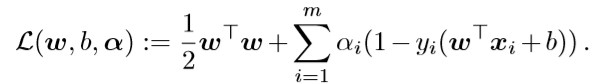
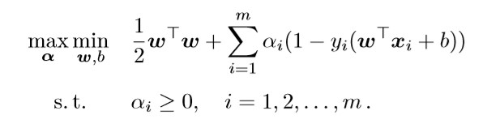
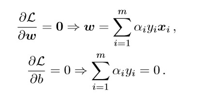
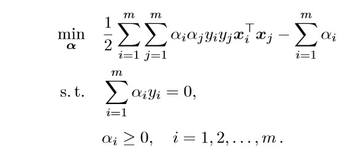
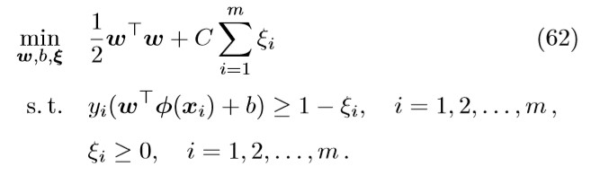
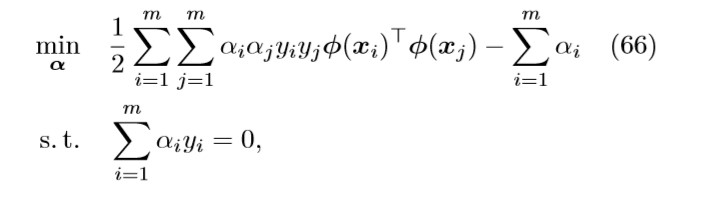
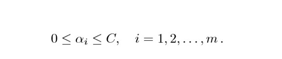
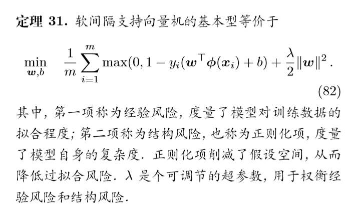

# 机器学习理论

## LR(逻辑回归)

1. 损失函数：交叉熵
2. 权重更新的推导。
3. 从权重更新的公式中，明白交叉熵相对于MSE损失的优点。

* MSE Loss

  $\frac{\partial(L)}{\partial{W}}=\frac{\partial}{\partial{W}}\sum(y_i-\frac{1}{1+e^{-(Wx+b)}})^2 = \sum(y-\pi(x_i))\pi(x_i)(1-\pi(x_i))x_i$                                                                                                                                                                                                                                                                                                                                                                                                                                                                                                                                                                                                                                                                                                                                                                                                                                                                                                                                                                                                                                                                                                                                                                                                                                                                                                                                                                                                                                                                                                                                                                                                                                                                                                                                                                                                                                                                                                                                                                                                                      

* Cross Entroy Loss 

  $\frac{\partial(L)}{\partial{W}}=\sum{(y-\pi(x_i))x_i}$

  在MSE的权重更新多了一个$\pi'(x)$, 当$\pi(x_i)=0.05, y_i=1$时，$\pi'(x)=0.05*0.95$很小，更新梯度小

4. 多个角度解释逻辑回归与SVM的之间的关系。

* LR和SVM都是分类模型。一般用于处理线性二分类问题

* 两个方法都可以增加不同的正则化项，如l1, l2等。 

* 两者都能用来做非线性分类，用核函数

* LR和SVM都是线性模型

* 都属于判别模型

  区别：

* LR是参数模型，SVM是非参数模型。

* 损失函数：LR用的是logistical loss, SVM用的是hinge loss.
* SVM不直接依赖数据分布，LR依赖，SVM只与支持向量有关。
* SVM本身是结构风险最小化的模型，LR是经验风险最小化模型
* 如果特征的数量大到和样本数量差不多，则选用LR或者线性核的SVM；
* 如果特征的数量小，样本的数量正常，则选用SVM+高斯核函数；
* 如果特征的数量小，而样本的数量很大，则需要手工添加一些特征从而变成第一种情况。

## SVM

1. 理解SVM目标函数的由来。

   * SVM基本型：

   

   * 拉格朗日函数

   

   * SVM的对偶型

   

   * 求导，得：

   

   * SVM的对偶问题等价于找到一组合适的参数$\alpha$,使得

   

   

   

2. 理解SVM中核技巧的使用。

   * 核技巧旨在将特征映射和内积这两步运算压缩为一步。核技巧希望构造一个核函数$\mathcal{K}(x_i, x_j)=\theta(x_i)^T\theta(x_j)$
   * 

3. 将目标函数转化成对偶问题的推导（软间隔，硬间隔）。

   * 软间隔支持向量机基本型
   * 
   * 对偶问题
   * 
   * 
   * 软间隔的SVM基本型相当于hinge loss.
   * 

4. 为什么要转换成对偶问题求解，求解的权重个数。

   * 对偶问题将原始问题中的约束转为了对偶问题中的等式约束

   * 方便核函数的引入
   * 对偶问题更容易求解

   * 改变了问题的复杂度。由求特征向量w转化为求比例系数a，在原始问题下，求解的复杂度与样本的维度有关，即w的维度。在对偶问题下，只与样本数量有关。

5. SMO(Sequential Minimal Optimization)

## reference:
    * [从零构建支持向量机(SVM)](https://funglee.github.io/ml/ref/svmhao.pdf)
