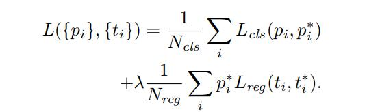

# Object detection 

主要是一些细节理解，大体上的方法网上一大堆。

* SSD
* YOLO系列
* RCNN系列 

## SSD 

* 结构 

* 损失

  

  * $alpha$论文中设置为1

  

  * $l_i^m$ : the predicted box 
  * $\hat g_j^{cx}$ : GT的偏置，由GT值和Anchor计算的来 
  * $x_{i,j}^p = \{0,1\}$如果第$i$-th个anchor对应第$j$-th类别p的GT值。 

  

  * ​	由两部分组成一部分是正样本的softmax，一部分是负样本的log损失

* 采样策略

  * 1：3正负样本采样，对于负样本，先对分数排序再采样。

* GT值如何计算（pos/neg如何定义）

  * 设置一个IOU，如果和GT值IOU>threshold，则为正（这里是否要NMS？）

## YOLO系列

### YOLOv1

* 

* loss:

1. $\lambda_{coord}=5, \lambda_{noobj} = .5$ 		
2. 对于回归损失，都是用的mse，w,h先开方再回归。

3. 对于分类损失，包括confidence损失，就是预测框和GT值得IOU。推理时用$Pr(class_i)*IOU_{pred}^{truth}$作为conf.

### YOLOv2

* yolov2对yolov1的改进主要是一些tricks上的堆叠。

个人认为比较重要的改进：

1. 参考ssd/faster rcnn使用了anchor，不同的是yolo是用kmeans对数据进行聚类。
2. 参考ssd使用了multi-scale training, 每次随机使用一种input size
3. batch normalization，老生长谈
4. yolov2参考了ssd/faster rcnn也预测offset，但是和ssd/faster rcnn的计算方法又不一样

### YOLOv3

* yolov3的改进

  1. 使用了金字塔结构(Darknet53)
  2. 分类损失之前用的mse, 改成BCE。

* yolov1输出的参数是$S\times S\times (B\times (4+1)+C)$即每个格子预测一个为同一个类，用$B$个anchor来回归，每个类相同。yolov3输出参数是$S\times S\times (B\times (4+1+C))$（SSD一样，但是SSD中1的含义是背景，而yolov3是置信度）。

  

  

## RCNN Series 

### RCNN 

* selective search + SVM 分类，相当于先crop再提特征，再分类。

### Fast RCNN 

* selective search + softmax
* 提出了ROIpooling。 

### Faster RCNN 

* rpn 

* 损失函数和ssd接近，offset的设置和ssd一致。

### Anchor Free 的方法 

* CenterNet
* CornerNet 

## 目标检测常用tricks

### OHEM

1. 两个ROI网络，上面那个ROI网络用来计算HARD EXAMPLE， 每次更新下面的ROI网络然后将权重赋给上面的。
2. 难样计算方法：计算ROI损失，用NMS去掉重复的，然后排序，去前N个。

### GIoU

* IoU loss 和 GIoU loss 都是一种回归损失，用于代替smooth L1 Loss. 

  $$GIoU = IoU - \frac{|C\(AUB)|}{C}$$

### Soft NMS

* 原来的nms只要iou>threshold就会把得分置0，而soft-nms当Iou>threshold时，得分会下降，下降有两种方式，一种是线性加权，一种是高斯加权。