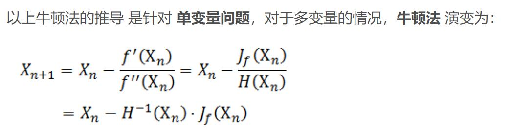
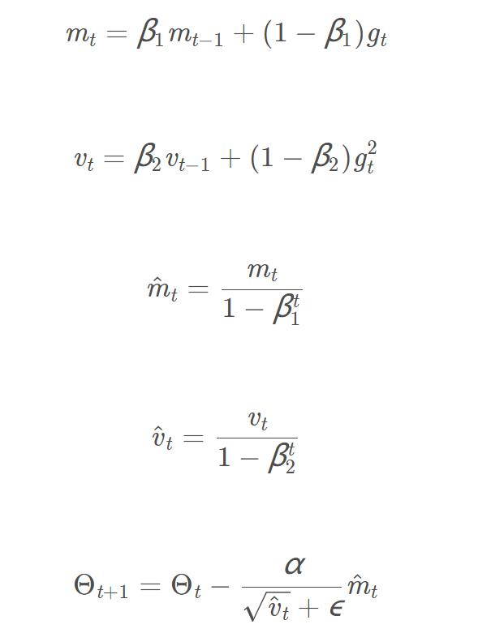

# 优化器

* 牛顿法VS梯度下降

* 牛顿法用的公式：

  $$x_{n+1}=x_n-\frac{f'(x_n)}{f''(x_{n+1})}$$

* 多变量时，牛顿法变为：

* 牛顿法的改进：L-BFGS / BFGS

* Adagrad (Adaptive Grad): $G_{i,i}$为之前该参数的梯度的平方和，该梯度之前改变越多，当前梯度越小。

  $$\Theta_{t+1,i} = \Theta_{t,i}-\frac{\alpha}{\sqrt{G_{t,ii}+\epsilon}}g_{t,i}$$

* RMSprop: 利用类似动量的方法，缓解Adagrad算法下降较快的问题。

  $$E[g^2]_t = 0.9E[g^2]_{t-1} + 0.1g_t^2$$

  $$\Theta_{t+1} = \Theta{t} - \frac{\alpha}{\sqrt{E[g^2]_t+\epsilon}}g_t$$

* 结合动量和RMSprop，

* Adam:

