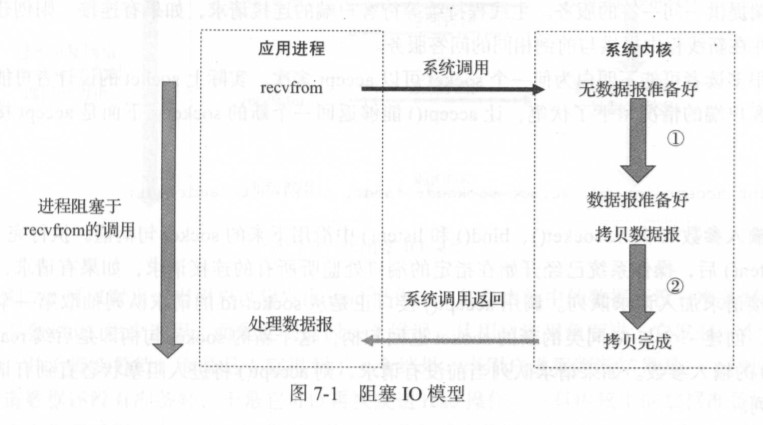
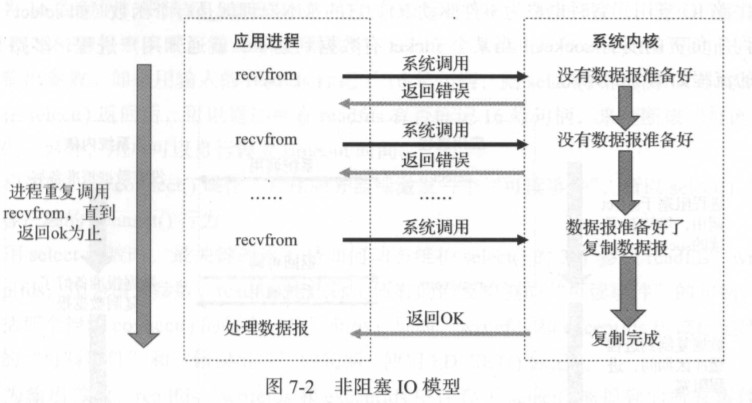
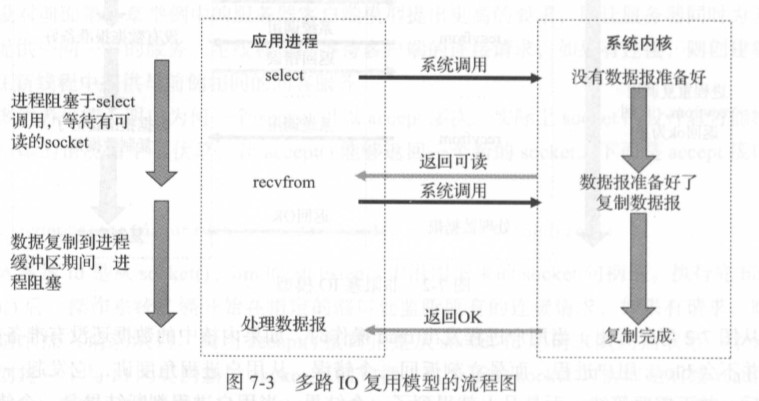
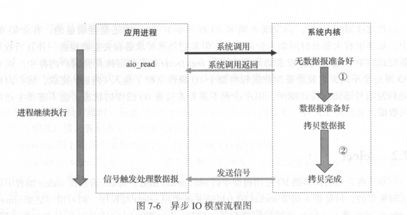
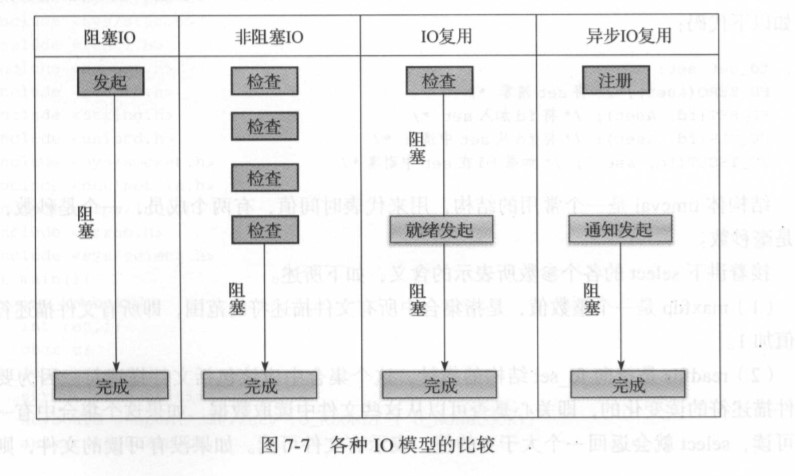

# 操作系统
1. 基本特征
   * 并发（并行/并发）：线程是并发的，进程是并行的
    1. 并发是指宏观上在一段时间内能同时运行多个程序，而并行则指同一时刻能运行多个指令。
    2. 并行需要硬件支持，如多流水线、多核处理器或者分布式计算系统。
    3. 操作系统通过引入进程和线程，使得程序能够并发运行。
   * 共享：共享内存（互斥共享/同时共享）
    1. 共享是指系统中的资源可以被多个并发进程共同使用。
    2. 有两种共享方式：互斥共享和同时共享。
    3. 互斥共享的资源称为临界资源，例如打印机等，在同一时刻只允许一个进程访问，需要用同步机制来实现互斥访问。
   * 虚拟：时间轮转/虚拟内存
    1. 虚拟技术把一个物理实体转换为多个逻辑实体。 
    2. 主要有两种虚拟技术：时（时间）分复用技术和空（空间）分复用技术。
    3. 多个进程能在同一个处理器上并发执行使用了时分复用技术，让每个进程轮流占用处理器，每次只执行一小个时间片并快速切换。
    4. 虚拟内存使用了空分复用技术，它将物理内存抽象为地址空间，每个进程都有各自的地址空间。地址空间的页被映射到物理内存，地址空间的页并不需要全部在物理内存中，当使用到一个没有在物理内存的页时，执行页面置换算法，将该页置换到内存中。
   * 异步：进程不是一次性执行完毕，走走停停。
    1. 异步指进程不是一次性执行完毕，而是走走停停，以不可知的速度向前推进。
2. 基本功能
   * 进程管理（进程状态，进程间通信，进程同步，进程调度）
   * 内存管理（内存分配，地址映射，内存保存与共享，虚拟内存）
3. 死锁
   * 必要条件：(1)互斥（1). 不可抢占 （2）占有且等待 . (2). 环路且等待 
   * 恢复：（1）杀死进程（2）回滚（3）抢占
   * 锁：读写锁/自旋锁。读写锁：分为读锁和写锁，读锁的话都可以读，写只有没有读锁/写锁的情况下才能写。自旋锁：自旋锁表示会一直占用CPU时间，所以对于只有单核单CPU的机器，自旋锁会有问题。乐观锁/悲观锁：读多写少用乐观锁，读少写多用悲观锁。乐观锁等更新的时候通过版本号判断是否拒绝。
4. 内存管理
   * 虚拟内存
   * 分页系统地址映射
   * 页面置换算法1.（最佳）2.最近最少使用（*LRU,用哈希表和双向链表实现）3.最近未使用 *4. 先进先出 5. 第二次机会算法 6. 时钟
   * 分页和分段的区别：（1）分段需要程序员显式划分/分页透明（2）分页是一维地址空间，分段是二维的。（3）分页大小不可变，分段大小可变（4）分页主要用于实现虚拟内存，从而获得更大的地址空间/分段主要是使程序和数据可以被划分成逻辑上独立的地址空间并有助于共享和保护。

5. 进程和线程的区别：（1）资源分配（2）开销（3）通信（4）场景（协程：效率高）

6. 程序的内存管理：从低地址到高地址分别为：（1）代码段（2）静态区（已初始化/未初始化）（3）堆（4）栈

7. 用户态和内核态：用户态和内核态是操作系统的两种运行级别，两者最大的区别就是特权级不同。用户态用用最低的特权级，内核态拥有较高的特权级。运行在用户态的程序不能直接访问操作系统内核数据结构和程序。内核态和用户态之间的转换方式主要包括：系统调用，中断和异常。为什么要分用户态和内核态：安全。在一些CPU指令中，有的指令用错或导致整个系统崩溃，内核提供API，用内核去执行这些指令。

## I/O多路复用

* 同步/异步/阻塞/非阻塞
* 用户空间/内核空间
* 进程切换
  * 保存处理机上下文，包括程序计数器和其他寄存器。
  * 更新PCB信息。
  * 把进程的PCB移入相应的队列，如就绪，在某事件阻塞等队列。
  * 选择另一个进程执行，并更新其PCB。
  * 更新内存管理的数据结构。
  * 恢复处理机上下文。
* 进程的阻塞
* 文件描述符
* 缓存IO
  * 操作系统会将IO的数据缓存在文件系统的页缓存中，数据会先被拷贝到操作系统内核缓存区中，然后才会被操作系统内核缓冲区拷贝到应用程序的地址空间。（缺点：数据在传输过程中需要在应用程序地址空间和内核进行多次数据拷贝操作，开销大）
  * 缓存I/O又被称为标准I/O，大多数文件系统的默认I/O操作都是缓存I/O。在LINUX的缓存I/O机制中，操作系统会将I/O的数据缓存在文件系统的页缓存（page cache)中，也就是说，数据会先被拷贝到操作系统内核的缓冲区中，然后才会从操作系统内核的缓冲区拷贝到应用程序的地址空间。
* select: 在网络编程中统一的操作顺序是创建socket->绑定端口->监听->accept->write/read，当有客户端链接来到时，select会把该链接的文件描述符放到fd_set，然后select会循环遍历它所检测的fd_set内的所有文件描述符，当select循环遍历完所有fd_set内指定的文件描述符对应的poll函数后，如果没有一个资源可用，则select让该进程睡眠，一直等到有资源可用为止，fd_set是一个类似于数组的数据结构，由于它每次都要遍历整个数组，所以她的效率会随着文件描述符的数量增多而变慢。另外，系统还需要把这些描述符集合从内核copy到用户空间，再copy回去，消耗大。
  * select和block I/O其实没有太大不同。事实上，还更差一些。因为这里需要使用两个system call（select和recvfrom)，而blocking I/O只调用了recvfrom。select的优势在于它可以同时处理多个connection.如果连接数不高，使用select/epoll的web server不一定比使用multi-threading+blocking I/O的web server性能更好。
* epoll:
  * LT（水平触发）
  * ET（边缘触发）
* epoll/select/poll的比较
  * select poll采用轮询方式，epoll采用回调的方式
  * select poll每次等待socket事件，都需要把所有socket从用户态拷贝至内核态，epoll则只需将socket添加一次到红黑树上即可。
  * select用数组来存放socket，因此受到数量限制。poll用链表存放，epoll用红黑树存放，因此不受数量限制。
  * select/poll/epoll虽然都会返回就绪的文件描述符数量，但是select/poll并不会明确指出是哪个文件描述符就绪，而epoll会。造成的区别就是，系统调用返回后，调用select和poll的程序需要遍历监听的整个文件描述符找到是谁处于就绪，而epoll则直接处理即可。

## Linux I/O模型

网络IO的本质是socket的读取，socket在linux系统被抽象为流，IO可以理解为对流的操作。对于socket流而言，第一步（1）等待网络上的树分组到达，然后被复制到内核的某个缓冲区。（2）把数据从内核缓冲区复制到应用进程缓冲区。

* 同步IO
* 阻塞IO
* 非阻塞IO
* 多路复用IO
* 异步IO

* 同步阻塞IO（在IO执行的两个阶段都被block了）
* 同步非阻塞IO

## 寄存器

* 保存地址和指令。
* 寻址/算术&逻辑运算

## 进程切换

* 保存处理机上下文，包括程序计数器和其他寄存器
* 更新PCB信息
* 把进程的PCB移入相应的队列，如就绪，再某些事件阻塞等待队列
* 选择另一个进程执行，并更新其PCB
* 更新内存管理的数据结构
* 恢复处理机上下文

## folk

* 创建父进程的子进程

## 协程

* 协程是可暂停和恢复执行的过程（过程就是函数）。

## 网络I/O模型

### 四种网络I/O模型

* 阻塞I/O模型

  

  * 当应用进程调用了recvfrom这个系统调用后，系统内核就开始了I/O的第一个阶段：准备数据。对于网络I/O来说，很多时候数据在一开始还没有到达时（比如还没有收到一个完整的TCP包），系统内核就要等待足够的数据的到来。而在用户进程这边，整个进程会被阻塞。当系统内核一直等到数据准备好了，它就会将数据从系统内核中拷贝到用户内存中，然后系统内核返回结果，用户进程才解除阻塞的状态，重新运行起来。所以，阻塞I/O模型的特点是在I/O执行的两个阶段（等待数据和拷贝数据）都被阻塞了。

* 非阻塞I/O模型

  * 

* 多路I/O复用模型

  * 
  * 这个模型和阻塞I/O的模型其实并没有太大不同，事实上还更差一些。因为这里需要使用两个系统调用（select和recvfrom），而阻塞I/O只调用了一个系统调用（recvfrom)。但是，用select的优势在于它可以同时处理多个链接。所以，如果处理的链接数不是很高的话，使用select/epoll的Web server不一定比使用多线程的阻塞I/O性能更好，可能延迟还更大；select/epoll的优势并不是对于当个链接能处理得更快，而是在于能处理更多的链接。

* 异步I/O模型

  * 

* I/O模型比较
  * 